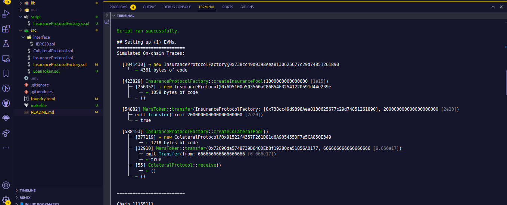
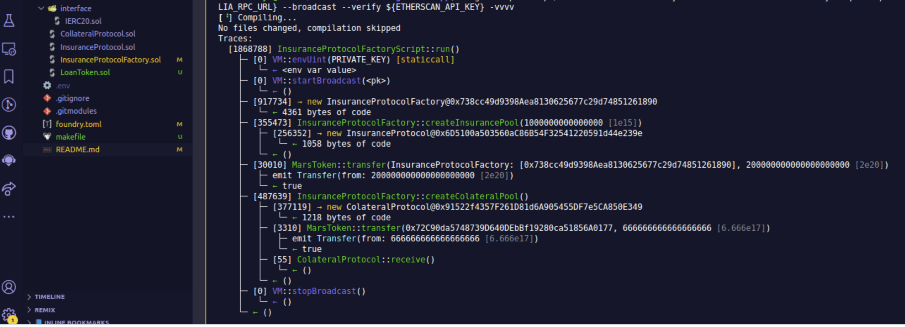
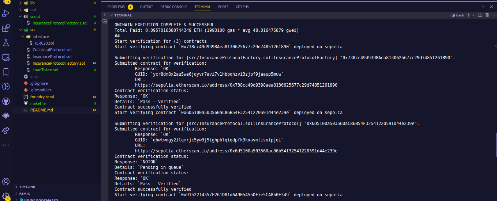
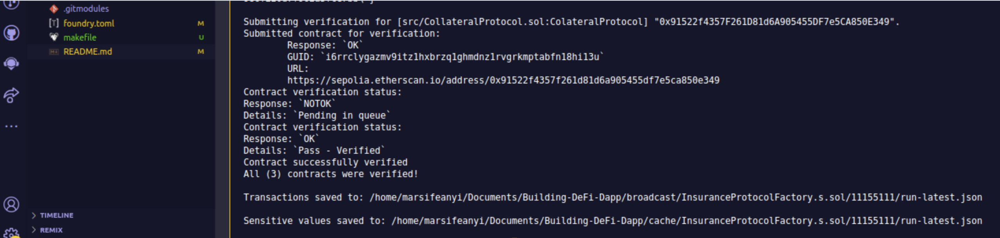

# Collateral and Insurance Protocol Contract

## Table of Content

- [Collateral and Insurance Protocol Contract](#collateral-and-insurance-protocol-contract)
  - [Table of Content](#table-of-content)
  - [Introduction](#introduction)
  - [Description](#description)
  - [Deployment of the Contracts on Sepolia testnet](#deployment-of-the-contracts-on-sepolia-testnet)
  - [Verification of the Contracts on Sepolia testnet](#verification-of-the-contracts-on-sepolia-testnet)
- [Author:](#author)
- [License](#license)
  

## Introduction
This is Solidity-based smart contracts in this project. The contracts enable users to purchase insurance and collateral for crypto-backed loans.

## Description

The project includes a factory contract model, which allows users to create either insurance contracts or collateral protection contracts. The factory contract can deploy instances of either a child contract based on user preference.

The insurance contract allows users to pay their premiums either monthly or annually. The collateral management contract, on the other hand, monitors the value of the user's collateral. If the collateral value drops below 20, the contract liquidates the collateral. Users can also repay their loans to retrieve their collateral.

## Deployment of the Contracts on Sepolia testnet

 ## Verification of the Contracts on Sepolia testnet

  Insurance Contract: https://sepolia.etherscan.io/address/0x6d5100a503560ac86b54f32541220591d44e239e

  Collateral Contract: https://sepolia.etherscan.io/address/0x91522f4357f261d81d6a905455df7e5ca850e349

  Factory Contract: https://sepolia.etherscan.io/address/0x738cc49d9398aea8130625677c29d74851261890

  # Author:
  Esther Oche https://twitter.com/Estheroche1

  # License
This project is licensed under the MIT License - see the LICENSE.md file for details.
